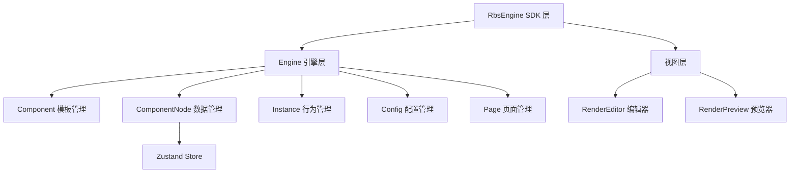

# Write Project Context

分析当前项目的代码结构和架构模式，生成一份标准化的 CLAUDE.md 项目文档。

## 触发条件

当用户提到以下内容时调用此 skill：
- "生成/写/创建 CLAUDE.md"
- "写项目文档/项目上下文"
- "分析项目架构"
- "初始化项目"
- "帮我了解这个项目"

## 文档结构

生成的 CLAUDE.md 必须包含以下章节，按顺序排列：

```
┌──────────────────────────────────────┐
│ 项目概述（必选）                       │  项目名称、简介、核心功能
├──────────────────────────────────────┤
│ 技术栈（必选）                         │  运行时、框架、UI库、状态管理、构建工具等
├──────────────────────────────────────┤
│ 目录结构（必选）                       │  src/ 下的完整目录树 + 各目录职责说明
├──────────────────────────────────────┤
│ 入口文件（必选）                       │  main.tsx → Router → Pages 的启动链路
├──────────────────────────────────────┤
│ 架构模式（必选）                       │  核心设计模式、数据流、分层架构
├──────────────────────────────────────┤
│ 配置说明（必选）                       │  vite.config、tsconfig、eslint、环境变量
├──────────────────────────────────────┤
│ 常用命令（必选）                       │  dev/build/lint/test 等脚本说明
├──────────────────────────────────────┤
│ 关键约定（可选）                       │  命名规范、目录约定、编码规范
├──────────────────────────────────────┤
│ API / SDK 使用（可选）                 │  库/框架级别项目的对外 API 说明
└──────────────────────────────────────┘
```

## 各章节编写规范

### 1. 项目概述

简洁说明项目是做什么的，包含：
- 项目名称（来自 `package.json` 的 `name`）
- 一句话描述（来自 `package.json` 的 `description`，有则用，没有则从代码推断）
- 核心功能列表（2-4 条要点）
- 作者/仓库信息（如有）

```markdown
# 项目名称

> 一句话描述

## 核心功能

- 功能点 1
- 功能点 2
```

### 2. 技术栈

从 `package.json` 中提取并分类：

```markdown
## 技术栈

| 类别 | 技术 | 版本 |
|------|------|------|
| 运行时 | React | ^18.3.1 |
| 语言 | TypeScript | ^5.5.3 |
| 构建工具 | Vite | ^5.4.1 |
| UI 组件库 | Ant Design | 4.24.1 |
| 状态管理 | Zustand | ^5.0.2 |
| 路由 | React Router | ^6 |
| 图表 | ECharts | ^5.6.0 |
| 代码编辑器 | Monaco Editor | ^0.52.2 |
| 国际化 | i18next | ^24.2.2 |
| ... | ... | ... |
```

分类方式：
- **运行时**：React、React DOM
- **语言**：TypeScript
- **构建工具**：Vite、相关插件
- **UI 组件库**：Ant Design 等
- **状态管理**：Zustand、Redux 等
- **路由**：React Router 等
- **样式方案**：Less、Sass、CSS Modules 等
- **图表/可视化**：ECharts 等
- **工具库**：ahooks、lodash-es、dayjs 等
- **质量工具**：ESLint、Prettier、Husky 等

### 3. 目录结构

输出 `src/` 下的完整目录树，并标注各目录职责：

```markdown
## 目录结构

├── src/
│   ├── main.tsx                 # 应用入口
│   ├── pages/                   # 页面组件
│   │   ├── index.tsx            # 编辑页面（主页面）
│   │   ├── preview/             # 预览页面
│   │   └── components/          # 页面级共享组件
│   ├── components/              # 全局通用组件
│   ├── engine/                  # 核心引擎
│   │   ├── index.ts             # Engine 类（主入口）
│   │   ├── store/               # 全局状态（Zustand）
│   │   ├── component/           # 组件模板管理
│   │   ├── componentNode/       # 组件数据实例管理
│   │   ├── instance/            # 组件运行时行为实例
│   │   ├── hooks/               # 引擎级 hooks
│   │   ├── model/               # 基础模型（事件系统等）
│   │   ├── config/              # 配置管理
│   │   ├── page/                # 页面管理
│   │   ├── favorites/           # 收藏夹管理
│   │   ├── enum/                # 枚举常量
│   │   ├── utils/               # 工具函数
│   │   └── built-in/            # 内置组件库
│   ├── export/                  # 对外 SDK 入口
│   ├── packages/                # 独立功能包
│   ├── hooks/                   # 通用 hooks
│   ├── utils/                   # 通用工具函数
│   ├── i18n/                    # 国际化
│   ├── router/                  # 路由配置
│   └── static/                  # 静态资源
```

对于每个目录，需要标注：
- **职责**：该目录负责什么
- **关键文件**：目录下最重要的 1-3 个文件

### 4. 入口文件

描述应用启动的完整链路：

```markdown
## 入口文件

### 启动链路

index.html → src/main.tsx → Router → Pages

1. **`index.html`** — HTML 模板，挂载点 `#root`
2. **`src/main.tsx`** — 应用入口
   - 创建 React 根节点
   - 注入路由（HashRouter）
   - 引入全局样式和国际化
3. **`src/router/index.tsx`** — 路由配置
   - `/` → 重定向到 `/create`
   - `/create` → 编辑页面（懒加载）
   - `/preview` → 预览页面（懒加载）
4. **`src/pages/index.tsx`** — 编辑主页面
   - 初始化 RbsEngine 实例
   - 加载初始 JSON 数据
   - 监听预览事件
```

### 5. 架构模式

识别并描述项目的核心设计模式，包括：

- **核心层级结构**（如：引擎层 → 数据层 → 视图层）
- **数据流**（单向数据流、状态管理方式）
- **关键抽象**（如数据与行为分离、模板与实例分离等）
- **模块间通信方式**（事件系统、全局状态、Context 等）
- **Mermaid 架构图**（推荐，便于可视化理解）

```markdown
## 架构模式

### 分层结构



### 核心设计

#### 模板-数据-行为 三层分离

| 层 | 管理对象 | 职责 |
|----|----------|------|
| Component | 组件模板 | 定义组件的 UI、属性面板、事件类型 |
| ComponentNode | 数据实例 | 组件的可持久化数据（位置、大小、配置） |
| Instance | 行为实例 | 运行时行为（hover、选中、拖拽） |
```

### 6. 配置说明

说明项目构建和工程化配置：

```markdown
## 配置说明

### Vite 配置（vite.config.ts）

- 开发服务器端口：`11000`
- 路径别名：`@` → `src/`
- Less 全局注入：`src/global.less`
- 代码分包策略：react-vendor / echarts / antd / monaco-editor / lodash-es / ahooks

### TypeScript 配置（tsconfig.json）

- target: ES2020
- 严格模式：开启
- JSX: react-jsx
- 路径别名：`@/*` → `src/*`

### ESLint 配置（.eslintrc.js）

- 解析器：`@typescript-eslint/parser`
- 继承：plugin:react/recommended + prettier
- 引号：双引号

### 环境变量

| 变量 | 说明 |
|------|------|
| `__DEV__` | 是否开发环境 |
| `VERSION` | 当前版本号 |
| `__LIB_MODE__` | 是否库模式构建 |
| `LIB_MODE` | 构建 ESM 库模式 |
| `mode` | 打包分析模式（analyzer） |
| `deploy` | GitHub Pages 部署标识 |
```

### 7. 常用命令

从 `package.json` scripts 提取：

```markdown
## 常用命令

| 命令 | 说明 |
|------|------|
| `pnpm dev` | 启动开发服务器 |
| `pnpm build` | 构建生产版本 |
| `pnpm build:lib` | 构建 ESM 库 |
| `pnpm lint` | 运行 ESLint 检查 |
| `pnpm preview` | 预览构建产物 |
| `pnpm commit` | 交互式提交（commitizen） |
```

### 8. 关键约定（可选）

从代码中观察到的约定：
- 文件/目录命名规范
- 组件编写规范
- Import 顺序约定
- 注释规范（JSDoc 格式等）

### 9. API / SDK 使用（可选）

如果是库/框架项目，说明对外 API：

```markdown
## SDK 使用

### 基本用法

\`\`\`typescript
import { RbsEngine } from "react-big-screen";

const rbsEngine = new RbsEngine();

// 挂载到 DOM
rbsEngine.mount(document.getElementById("app")!);

// 导入 JSON 数据
await rbsEngine.importJSONString(jsonText);

// 导出 JSON 数据
const json = await rbsEngine.exportJSON();

// 监听事件
rbsEngine.on("startPreview", async (engine) => {
  const json = await engine.getJSON();
  // 处理预览逻辑
});

// 销毁
rbsEngine.destroy();
\`\`\`
```

## 执行流程

### 1. 快速扫描（只读）

按顺序读取以下文件获取项目基础信息：

| 顺序 | 文件 | 获取内容 |
|------|------|----------|
| 1 | `package.json` | 项目名、描述、依赖、scripts |
| 2 | `vite.config.ts` / `next.config.js` / `webpack.config.js` | 构建配置、别名、端口 |
| 3 | `tsconfig.json` | TS 配置、路径映射 |
| 4 | `src/main.tsx` / `src/index.tsx` / `src/App.tsx` | 入口文件、启动逻辑 |
| 5 | `src/router/` | 路由配置、页面列表 |
| 6 | `.eslintrc.js` / `.eslintrc.json` | 代码规范配置 |

### 2. 目录扫描

```bash
find ./src -maxdepth 3 -type d | sort
```

分析 `src/` 下各目录的职责和关键文件。

### 3. 架构分析

读取核心模块的入口文件（如 `engine/index.ts`、`store/index.ts`）以理解架构模式。

### 4. 生成文档

按上述章节规范生成 CLAUDE.md，写入项目根目录。文档完成后报告文件位置和各章节概要。

## 注意事项

1. **尊重已有内容**：如果项目已有 CLAUDE.md，先读取，保留其中仍有效的自定义内容（如特定业务约定），只更新客观事实部分（版本号、新增目录等）
2. **版本号从 package.json 提取**，不要自己编造
3. **不要虚构不存在的技术**，只记录项目中实际使用的依赖
4. **目录树展示 2-3 层即可**，避免过深导致文档臃肿
5. **架构图用 Mermaid**，便于渲染和阅读
6. **不要包含 .claude/、node_modules/、dist/、.git/** 等工具/构建目录
7. **如果某可选章节不适用，就跳过**，不要硬写
8. **文档长度控制在 300-500 行**，保持精炼
