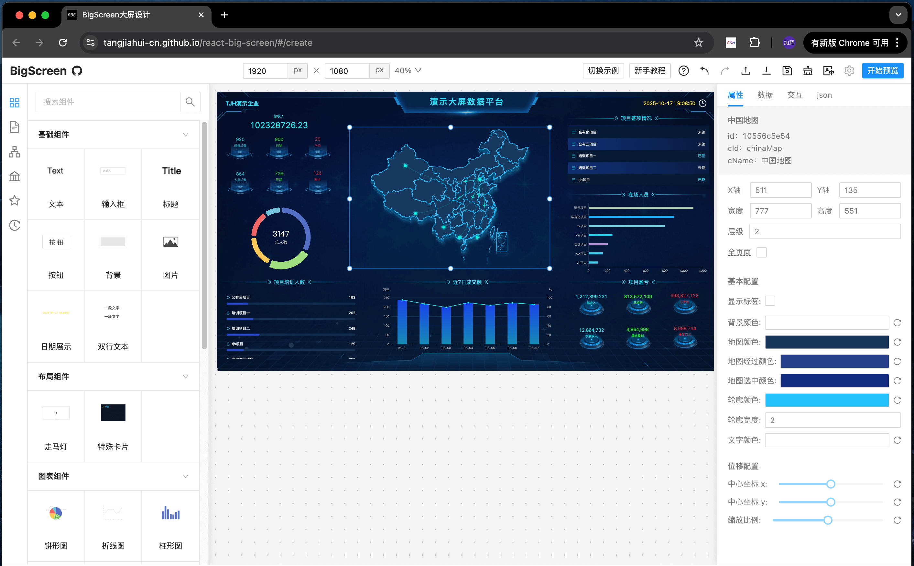
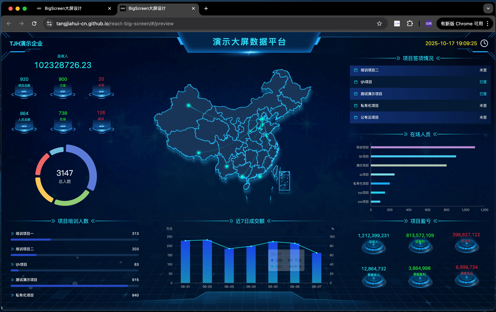

<h1 align="center">react-big-screen</h1>

<p align="center">A drag-and-drop visual editor for building React data big-screens — usable standalone or embedded in your app as an ESM SDK.</p>

<p align="center">
  <a href="./README.md">简体中文</a> | <a href="./README.en-US.md">English</a>
</p>

<p align="center">
  <a href="https://www.npmjs.com/package/react-big-screen"></a>
  <a href="https://github.com/tangjiahui-cn/react-big-screen"></a>
  <a href="https://tangjiahui-cn.github.io/react-big-screen"></a>
  
</p>

react-big-screen is a visual big-screen editor built on React 18. By dragging and configuring components, you can quickly assemble a data big-screen. It can be used in two ways:

- **Standalone editor**: build a page visually on the canvas, then preview or share the running result directly.
- **Embeddable SDK**: the entire screen is driven by a single piece of JSON and exposed through `RbsEngine`, letting you embed the editor or the runtime page into your own React project.

## Screenshots

Edit mode:



Preview mode:



## Core Features

- ✅ Drag & drop system
- ✅ Group / ungroup
- ✅ Box selection
- ✅ Right-click context menu
- ✅ Keyboard shortcuts
- ✅ Multi-component interaction
- ✅ Multi-page management
- ✅ Custom components
- ✅ Custom property panels
- ✅ Adaptive preview page
- ✅ Container components
- ✅ Alignment guides
- ✅ Load remote components
- ✅ i18n internationalization
- ✅ Undoable history records
- ✅ Import / export files
- ✅ SDK support

More capabilities are available in the source code.

## Core Design

| Design             | Description                                                                                                                                                  |
|--------------------|--------------------------------------------------------------------------------------------------------------------------------------------------------------|
| DSL-driven         | The entire screen is described by a unified JSON DSL capturing page structure, component config, data binding, and inter-component event relations. The editor and the preview runtime share the same page document model. |
| Component system   | Extend the editor's capabilities through a component registration mechanism, with support for custom components, custom property panels, container components, and remote components. |
| Event system       | Inter-component coordination is implemented via a `trigger → expose` event chain, so a component never depends on other component instances directly. |
| Data system        | Each component can independently bind to static data or a remote API data source, with support for polling refresh. |
| Editor capabilities | Drag, resize, box selection, grouping, alignment, shortcuts, and history records all work uniformly around component nodes. |
| Multi-page model   | One big-screen can contain multiple sub-pages. Only the current page is rendered; the others keep their document data without being rendered. |
| Remote components  | Supports loading UMD / AMD / zip component packages and caches remote component resources in IndexedDB. |
| SDK embedding      | Exposes capabilities such as `mount`, `importJSON`, and `exportJSON` through `RbsEngine`, so the full editor or preview runtime can be embedded in other React applications. |

## Architecture

```text
┌───────────────────────────────────────────────┐
│              Host React application           │
│   import { RbsEngine } from "react-big-screen"│
└───────────────────────┬───────────────────────┘
                        │
              mount · importJSON · exportJSON
                        │
                        ▼
┌───────────────────────────────────────────────┐
│             RbsEngine — SDK layer             │
│   edit mode (RenderEditor) / preview mode     │
│                (RenderPreview)                │
│                                               │
│   ┌──────────── Engine core ──────────────┐   │
│   │ Component templates · ComponentNode   │   │
│   │ data · runtime instances · Config     │   │
│   └───────────────────────────────────────┘   │
│   ┌────────── Editor packages ────────────┐   │
│   │ dragMove · resize · alignGuide        │   │
│   │ contextMenu · historyRecord · keys    │   │
│   └───────────────────────────────────────┘   │
└───────────────────────┬───────────────────────┘
                        │  JSON in/out · events
                        ▼
┌───────────────────────────────────────────────┐
│      State layer                              │
│   Zustand stores · BaseEvent pub/sub          │
│   IndexedDB (remote component cache)          │
└───────────────────────────────────────────────┘
```

## Usage Example

```tsx
import { useEffect, useRef } from "react";
import { EXAMPLE, RbsEngine } from "react-big-screen";
import "antd/dist/antd.min.css";
import "react-big-screen/es/style.css";

export default function Screen() {
  const hostRef = useRef<HTMLDivElement>(null);

  useEffect(() => {
    const engine = new RbsEngine(); // edit mode by default
    engine.mount(hostRef.current!).then(() => {
      engine.importJSON(EXAMPLE.classic); // render an example big-screen
    });

    return () => {
      engine.destroy(); // unmount and clean up
    };
  }, []);

  return <div ref={hostRef} style={{ width: "100vw", height: "100vh" }} />;
}
```

The snippet above mounts the full editor and loads an example big-screen. For a read-only runtime view, call `engine.enablePreview()` before `mount()` / `importJSON()`.

## Quick Install

```shell
pnpm add react-big-screen
```

Environment requirements: Node 20+, React 18. Import the required styles once in your app:

```tsx
import "antd/dist/antd.min.css";
import "react-big-screen/es/style.css";
```

## Quick Start

The fastest way to try it is the online editor — no installation needed:

- Online demo: [https://tangjiahui-cn.github.io/react-big-screen](https://tangjiahui-cn.github.io/react-big-screen)
- Feature demo (multi-component interaction): [Open example](https://tangjiahui-cn.github.io/react-big-screen/#/create?example=multiple-components-interactive)

Run the full editor locally:

```shell
git clone https://github.com/tangjiahui-cn/react-big-screen.git
cd react-big-screen
pnpm install
pnpm dev
```

The dev server runs at http://localhost:11000 by default.

## Community & Support

- Author's big-screen principles column series: [前端大屏原理系列（掘金）](https://juejin.cn/column/7492086179995811855)
- Report issues or request features: [GitHub Issues](https://github.com/tangjiahui-cn/react-big-screen/issues)

## Star History

[](https://star-history.com/#tangjiahui-cn/react-big-screen&Date)
