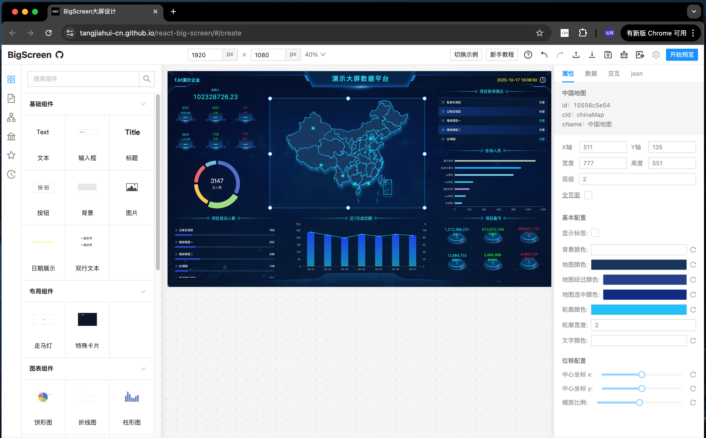
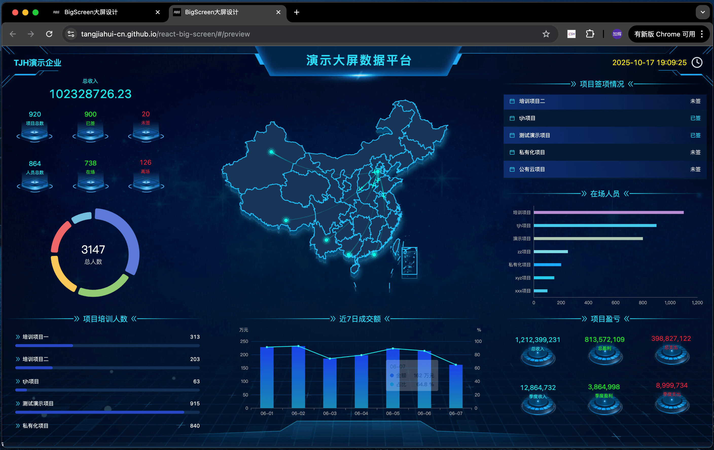

# React-Big-Screen

一个使用 React 框架实现的 `前端大屏拖拽平台`，只需要简单的拖拽、配置即可设计出不错的大屏页面。

> 状态：`开发中`

## 在线预览
[https://tangjiahui-cn.github.io/react-big-screen](https://tangjiahui-cn.github.io/react-big-screen)

## 页面截图

编辑：



预览：



## 功能特点

- ✅ 拖拽移动、缩放。
- ✅ 快捷键。
- ✅ 批量处理组件。
- ✅ 自定义新组件。
- ✅ 自定义组件属性配置面板。
- ✅ 自定义组件右键菜单。
- ✅ 鼠标范围框选。
- ✅ 支持预览页面。
- ✅ 成组/取消成组。
- ✅ 布局容器组件。
- ✅ 属性配置面板（属性、数据、交互）。
- ✅ 多组件联动。
- ✅ 支持远程组件包。
- ✅ 收藏夹。
- ✅ i18n 国际化语言。
- ✅ 支持多子页面切换。
- ✅ 可撤销历史记录。

## 设计理念

`数据`与`逻辑`分离。

## 核心概念

读取 `json格式对象`，将`components`与`componentNodes`合并渲染到页面，渲染过程中注册`instance`，编辑器通过修改 `componentNodes` 生效变更。

- engine: 全部api的集合，统一管理所有的功能。
- component: 注册的组件模板。
- componentNode: 组件的数据实例，也是完整导出、保存的数据。
- instance: 组件运行时的行为实例，管理单个组件所有的内部行为。
- store：存储全局数据（不做复杂action，仅用作响应式变量触发引用位置更新）。
- 实例：等于component + componentNode + instance。

## dom 事件
点击事件只涉及到: `click`、`mousedown`、`mousemove`、`mouseup`。

## 多组件联动

自己单独实现了一套事件机制。`component`中声明了暴露事件列表`exposes`、触发事件列表`triggers`。

- `exposes` 是暴露给外界，用来调用内部事件的端口。
- `triggers` 是声明内部可以触发的事件，用来在 \[属性面板-交互\] 中读取该列表进行配置与其他组件联动。

关于组件内部使用？

在 `props` 中获取 `useExpose`、`handleTrigger`。通过 `useExpose` 去定义运行时暴露的事件行为，`handleTrigger` 去触发内部事件的执行。

## 远程组件

通过远程组件功能，可以拥有个人资产。

> 在 `src/common-module.ts` 文件中配置公共模块配置，以此减小远程组件包体积。

加载方式：
- 本地上传
- 远程URL

支持格式：

- 支持 UMD 模块包。
- 支持 AMD 模块包。
- 支持 .zip 压缩包。

## 容器组件

容器包含很多个面板，通过切换不同面板，实现显隐不同组件的效果。

主要关注 `componentNode` 的三个属性：`panels`、`currentPanelId`、`panelId`。

- panels：当前容器组件所包含的全部面板（panel是容器的一个面板）。
- currentPanelId：当前容器组件展示的面板 panel 的 id。
- panelId: 所属父容器 panels 中某个面板的id。

若开发一个容器组件，只需要组件内部修改 `panels`、`currentPanelId` 即可，`panelId` 是引擎自动绑定的。

核心API：
- engine.componentNode.hidePanel：隐藏一个面板全部子组件
- engine.componentNode.showPanel：显示一个面板全部子组件

## 自定义组件

开发自定义组件，只需要3步：
- 定义一个 `ComponentType` 对象。
- 使用 `createComponent` 创建一个模板组件。
- 使用 `createAttributes` 创建一个属性配置项组件。

示例：

```tsx
import engine, { ComponentType, createComponent, createAttributes } from '@/engine';

// 配置属性值类型
interface Options {
  value: string; // 值
}

// 模板组件
const Component = createComponent<Options>(props => {
  const { options, width, height } = props;
  return (
    <div style={{ width, height }}>
      {options?.value}
    </div>
  )
})

// 属性配置组件
const Attributes = createAttributes<Options>(props => {
  const { options, onChange } = props;
  return (
    <div>
      <input
        value={options?.value}
        onChange={e => onChange({ value: e.target.value })}
      />
    </div>
  )
})

// 注册组件
engine.component.register({
  cId: 'demo-text', // 组件id（必填、唯一）
  cName: 'demo-文字', // 组件名称
  x: 0, // 初始 x
  y: 0, // 初始 y
  width: 200, // 初始宽度
  height: 32, // 初始高度
  component: Component, // 模板组件
  attributesComponent: Attributes, // 属性配置组件
})
```

## 多页面管理

多页面，主要适用于一个大屏多个子页面的场景。

> 展示一个页面时，其他页面会卸载，不渲染而只保留数据，因此不会造成性能损失。

若要控制多页面切换，需要开发`导航组件`：
- `usePages`：实时获取所有页面
- `useCurrentPageId`: 获取当前页id
- `selectPage`: 选中对应页面（即切换页面）

常见场景：
- 单大屏多子页面：顶部的导航栏tabs，点击打开目标子页面。
- 类SPA站点：头部面包屑导航，点击跳转对应页面。
- 单页面文档站点：导航下拉框，快速打开对应文档页。

> **为什么会出现子页面，容器组件难道不行吗？** <br><br>
> 答：子页面会完整的加载、卸载、刷新一个页面的全部组件，而容器包含的所有组件一直存在（只会随页面卸载而删除）。

## 设计复杂页面

若要实现复杂页面，则需将页面元素抽象成 一个个的实例，多个实例通过`暴露事件`、`触发事件`相互沟通。

在 `react-big-screen` 中，事件机制是一个十分重要的功能，甚至可以触发自身的 `暴露事件`!

> 例如：设计一个中后台查询表格页。我们只需要准备`按钮`、`表格`，点击 `按钮` 触发表格暴露的 `查询` 事件即可。如果想要修改查询参数，则只需要设置解析函数。

另外，有时候会用到多页面管理，在一个页面中支持切换多个子页面。 可以单独开发 `导航组件`，用于管理页面的切换、或当做路由面包屑等。

## 性能优化
### (1) 组件独立更新
每个组件更新时，只会更新当前渲染节点，而不会更新所有组件。

### (2) 拖拽优化
单个或多个组件拖拽过程中，实时修改对应dom的位置，拖拽结束才会保存生效变更范围内的组件。

### (3) 隐藏组件不渲染
有些不显示的组件，例如处于容器中、或者show设置false等，不会在页面上渲染。等到外界控制其显示时，局部更新其节点重新渲染，而不会影响所有组件。

### (4) 远程组件包优化
组件包下载后，源码存储在浏览器端`IndexedDB`中，不会占用内存。下载时，才会从浏览器存储中取出。

### (5) vite 构建优化
手动分包，将`monaco-editor`等固定不变的大型包单独划分chunk便于更好的利用缓存。<br>
一些随着按需加载体积不断增大的包单独划分（例如：`antd`、`ahooks`等），避免每次改动都更新其他未修改包。<br>

### (6) 按需加载
同时`nginx`设置`gzip`，体积可再次减小`75%`。<br>

常见库替换：
- `dayjs`：代替moment。
- `lodash-es`：代替lodash。

大型库按需加载：
- `echarts`：减小 46%。1050kb => 570kb。
- `monoco-editor`：减小 36%。3600kb => 2308kb。

### (7) 使用“事件委托”实现拖拽
在编辑器容器处监听`mouse`事件，通过`dom.dataset.id`获取实例的一切信息，并借此实现组件移动、放置layout、范围框选中等。无需创建实例数量的事件监听器，节省内存提高性能。

### (8) 合并事件
一个事件同时运行多个功能。例如 `startMove` 支持 `hookQueue`，一次点击流程（`mousedown` -> `mouseup`），即可依次运行每个功能注册的回调函数，无需拖拽实例、选中实例功能各自创建一个`mousedown`的事件监听。

### (9) 异步组件
`component` 和 `attributesComponent` 支持传入`React.lazy(() => import("./...")` 形式，以支持异步组件，减小首屏加载包体积。

### ...

## 相关项目
- [lowcode-engine](https://github.com/tangjiahui-cn/lowcode-engine)

## 本地调试
```shell
# 安装依赖（node@v20.15.1 pnpm@9.13.2）
pnpm i

# 运行
pnpm dev
```

## 开发日志

### v0.0.1 （进行中）
完成基本大屏功能，支持拖拽移动设计大屏页面，修改页面组件属性，并支持上传导入、导出，可预览。

- ✅ 基本布局
- ✅ 拖拽组件到页面创建
- ✅ 内置几种类型组件
- ✅ 选中组件/范围框选
- ✅ 组件锁定/解锁
- ✅ 拖拽移动/缩放
- ✅ 编辑器 右键菜单禁用
- ✅ 组件右键菜单（复制、删除、上移一层、下移一层、置顶、置底）
- ✅ 完成页面右侧属性面板 (属性、数据、交互，共 3 类配置面板)
- ✅ 完成预览页面
- ✅ 成组/取消成组
- ✅ 布局容器组件
- ✅ 缓存请求
- ✅ 多组件联动
- ✅ 上传本地 / 加载远程组件包
- ✅ 收藏夹
- ✅ 页面组件列表
- ✅ 自定义组件
- ✅ i18n 国际化语言。
- ✅ 支持多子页面切换。
- ✅ 可撤销历史记录。
